🚀 Get to pre-production in weeks, not months, with private [training](https://www.jube.io/jube-training) direct from Jube's developer — real sovereignty, zero vendor lock-in.

# Authentication Concepts

The Jube user interface sits atop of an API stage that can viewed by a Swagger interface as follows:

http://localhost:5001/swagger/index.html

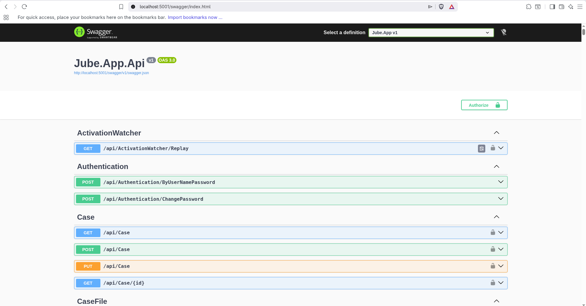

All but the Authentication endpoints, which exist for the purpose of creating an endpoint, require an authentication
token:

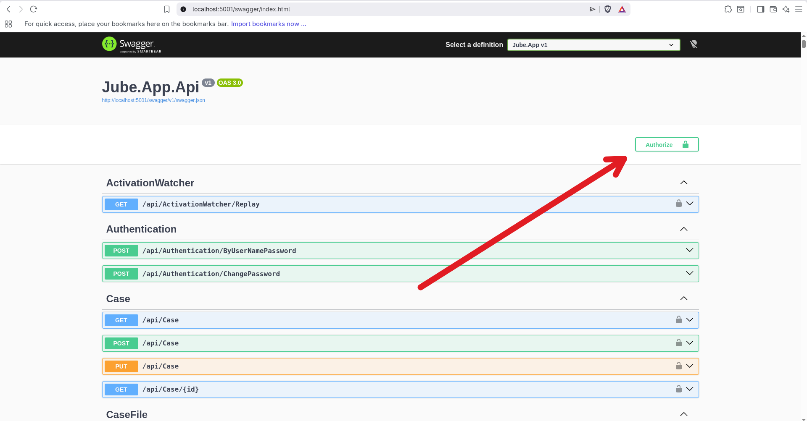

Clicking Authorise in the above case allows for the keys to be used throughout the Swagger session:

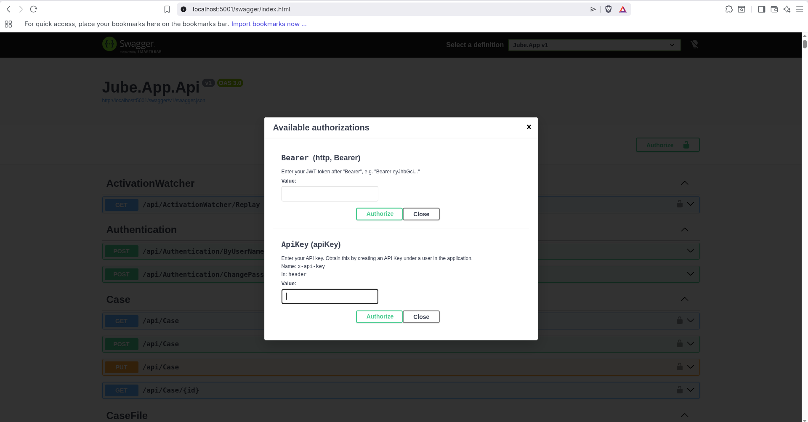

The keys in the above example are for illustrative purposes only however, and are analgous to HTTP headers:

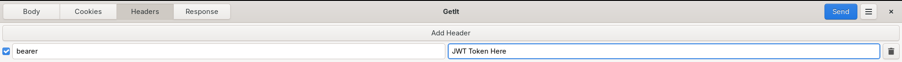

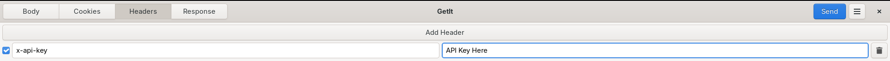

Both methods of authentication are perfectly valid, and they share the same permissions approach, which means to say that
both tokens only claim a user identity, with permissions being evaluated server side, and without the use of claims in
the token.

JWT is not intended for API integration, notwithstanding that the user interface is a fascia of the API's, and the use of
API Key is encouraged for all formal integration beyond the user interface.

# JWT Token Generation and Cookie Middleware

JWT Token Generation is not nessicarity a visible concept, in respect to remarks as being authentication made available
for the user interface primarily. For completeness however, the user interface makes use of the following endpoint
to trade a username and password for a JWT token:

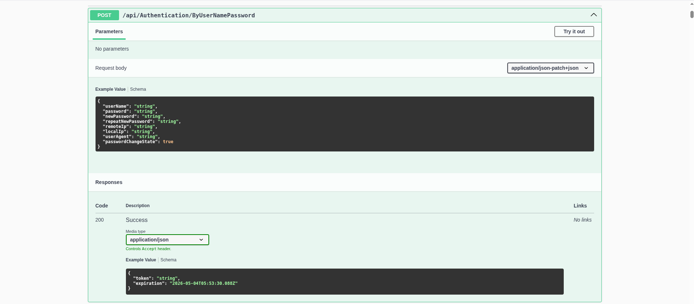

The above endpoint is highly inappropriate for use in external integration however, as it has a defined protocol that
may signal password resent demands (which is not to say that an API Key does not tie to an account, but it is evaluated
on a straight through real-time basis, and is not subject to expiry).

As the JWT Token Generation is intended for User Interface authentication, it also includes a step to pack the JWT Token
into a cookie, and evaluates this cookie on each request, replacing the JWT token if close to expiry. For real-time
integration especially, the Invoke controller, cookie maintainance is not appropriate.

# API Key Generation

API Keys are created for Users via the User Interface. Navigate Admiistration >>> Security >>> Users:

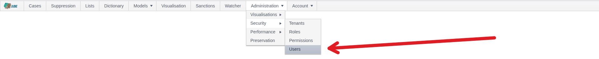

Navigating to a User as otherwise documented, and taking note of the Generate API Key button:

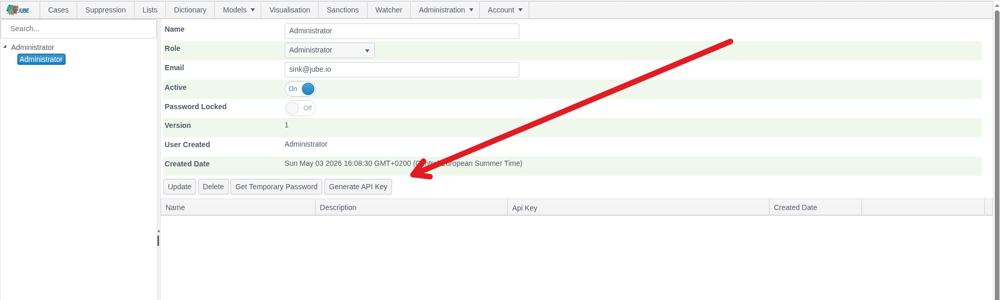

A user can have many API Keys to faciliate rotation. Click on Generate API Key:

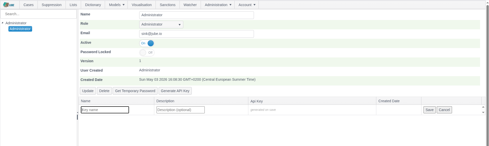

Complete the API Key's Name, and optionaly a Description:

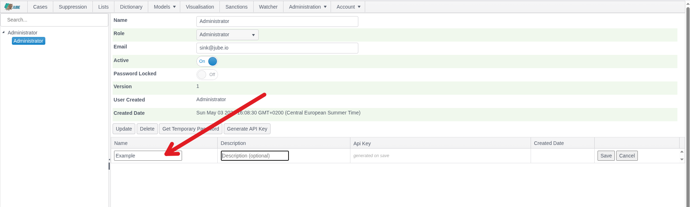

Click Save to generate the API Key:

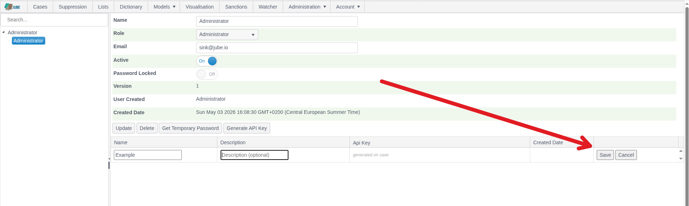

On clicking Save, the API Ket will be exposed:

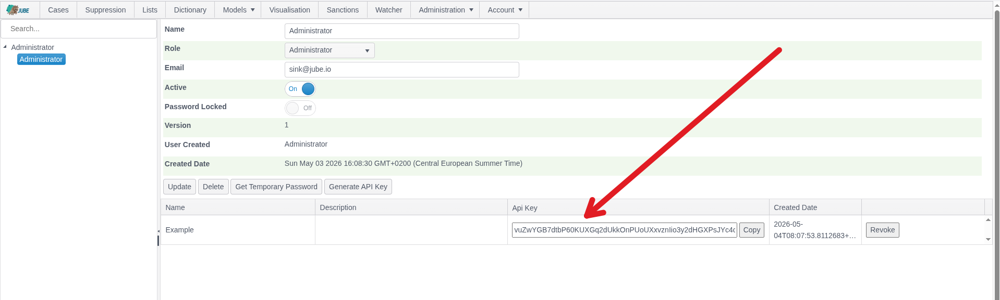

The API Key is not stored and this is the only time the API Key is available in the clear. The API Key is stored as a
hash and is evaluated on a cryptographic basis. Keep the API Key safe, as it can't be recovered, but of course new API
Keys can be rotated in.

Each API key encodes the user identity and a tamper-evident checksum, secured with HMAC-SHA256. When a key is included
in a request, it is validated against an in-memory cache of active tokens — verifying the embedded checksum and
confirming the key has not been revoked — before the request is processed. Keys are stored and compared by their SHA-256
hash, so your raw key is never retained server-side. The first eight characters of your key serve as a display-safe
identifier for auditing and support purposes.

The active API Key cache is maintained in the application and refresed minute, while also subscribing to publish
events emmited via the Redis cache for more timely syncronisation of API Key creation and revoke. Redis cache publish
subscribe if reliable, but not guranteed, hence the fall back in synconisation each minute. Redis publish and suscribe
is most material in revoke events.

The API Key depends on a secret set in the Environment Variables `ApiHmacKey` and is intrinsic to the applications
security and integrity of the API Key.

In the case of no active key found or cryptographic evaluation failure, the authentication is failed for the same
outward reason of "Key Not Found".

# Order of Precidence

The authentication middleware handles tokens in the following order of precidence, and will evaluate exlusively:

* x-api-key.
* bearer (JWT).
* cookie (JWT).

Everything above this point concerns how a request is authenticated once a user's identity has already been
established. The sections below cover the three ways that identity can be established in the first place - Jube's
own Username and Password, Negotiate (Windows Integrated/Kerberos), and OAuth/OpenID Connect - along with
Multi-Factor Authentication, which layers on top of the first two. In every case, once identity is established Jube
issues its own JWT and cookie exactly as described above - none of the three schemes changes how the rest of the
API is authenticated afterward.

# Authentication Schemes

Jube supports three mutually exclusive schemes for establishing a user's identity at login. Username and Password is
Jube's own built-in scheme; OAuth and Negotiate are alternatives that delegate identity verification elsewhere.
OAuthAuthentication and NegotiateAuthentication cannot both be True at once, and Username/Password login (including
password changes) is disabled whenever either of the other two is enabled - there is no scenario where more than one
scheme is live at a time.

## OAuth / OpenID Connect

Setting OAuthAuthentication to True enables OAuth 2.0 / OpenID Connect as the login scheme, using the authorization
code flow with PKCE. Configure the identity provider via OAuthAuthority, OAuthClientId and OAuthClientSecret - see
[Environment Variables](../EnvironmentVariables/index.html).

When OAuth is enabled, the Login page redirects straight to the identity provider rather than showing Jube's own
username/password form. On successful sign-in, Jube looks up the returned identity claim (trying, in order, the
claims a provider is most likely to populate) against the UserRegistry - **the user must already exist and be
active in Jube**; OAuth verifies who the person is, it does not create an account for them. If no matching active
user is found, sign-in fails and the browser is returned to the Login page.

Jube continues to issue its own JWT and session cookie after a successful OAuth sign-in, exactly as it does for
Username/Password or Negotiate - identity verification is delegated to the OAuth provider, but session/token
issuance is not.

Multi-Factor Authentication is assumed to always be handled by the OAuth identity provider itself - Jube does not
add a second MFA step of its own on top of an OAuth sign-in the way it can for Negotiate (see below).

By default the callback response uses OpenID Connect's form_post mode; OAuthForceGet switches to a GET/query-string
response for identity providers that require it. Redirect-after-login is restricted to local URLs only (so a user
returns to the page they were on before being redirected to sign in), guarded against open-redirect attempts.

The `OAuthForceRedirect` environment provides the option to ignore the RedirectUrl propaganted through OAuth, 
and override it with an explicit redirect, so that a singular landing page can be enforced.

## Negotiate (Windows Integrated / Kerberos)

Setting NegotiateAuthentication to True enables Negotiate authentication - commonly known as Windows Integrated
Authentication against Active Directory - as an alternative to Username/Password. This is common in corporate
environments where the browser can silently present the signed-in Windows user's credentials.

The Login page loads with the username/password form hidden and immediately calls `GET api/Authentication/ByNegotiate`
in the background. That endpoint requires Negotiate authentication, so a browser configured for integrated
authentication (for example, a domain-joined machine with the site in its trusted intranet zone) completes the
Kerberos/NTLM handshake transparently and the call succeeds without the user seeing a login form at all; a browser
that cannot complete the handshake gets a 401, and the page falls back to showing the manual login form. If
Multi-Factor Authentication is also enabled, a successful Negotiate handshake returns 202 instead of signing in
directly, and the page reveals only the MFA field for the user to complete.

## Multi-Factor Authentication (RSA SecurID)

MFA is implemented behind an `IMfaProvider` abstraction (`Jube.Mfa`), with RSA SecurID as the only provider currently
shipped (`RsaSecurIdMfaProvider`). Nothing in configuration selects between providers today since there is only the
one, but the separation exists so an alternative second factor could be added without reworking the authentication
pipeline that calls it.

Setting EnableMultifactorAuthentication to True adds a second authentication step - an RSA SecurID one-time
passcode - enforced after either Username/Password or Negotiate sign-in (not after OAuth, which is assumed to
already cover MFA at the identity provider). Configure the real RSA Authentication Manager endpoint via
MultifactorAuthenticationEndpoint, MultifactorAuthenticationApplicationId and MultifactorAuthenticationClientKey -
see [Environment Variables](../EnvironmentVariables/index.html).

MultifactorAuthenticationEndpoint defaults to `http://localhost:5001/api/mfa`, which resolves to Jube's own bundled mock RSA endpoint (it accepts only
the fixed OTP value `12345678`, and only while MultifactorAuthenticationClientKey is left at its own shipped default).
Enabling EnableMultifactorAuthentication without also pointing MultifactorAuthenticationEndpoint at a real RSA
Authentication Manager will silently succeed against the mock rather than performing genuine second-factor
verification - both settings must be changed together before MFA can be considered actually enforced.

For outbound calls to the RSA endpoint, OutboundHttpRsaAmCertificateBypass disables TLS certificate validation
entirely (avoid in production), and OutboundHttpRsaAmCertificateThumbprint instead pins trust to one specific
certificate by its SHA-1 thumbprint, tolerating chain-trust errors only - the safer option of the two where the
RSA endpoint sits behind a certificate that doesn't chain to a publicly trusted root. Both are currently implemented
for the RSA MFA endpoint only, not for HTTP Adaptation or other outbound webhooks.  Generally speaking, the cause of a 
certificate error should be fully understood, and while in middleware it is commonplace will nontheless require some
explanation.

## Login Lockout and Session Behaviour

PasswordAttempts (default 3), otherwise controlled in the Evnrionment Variable `PasswordAttempts`, controls how many 
consecutive incorrect password attempts are tolerated before an account is locked - note that with the default value 
the account locks on the **fourth** consecutive failure, since the check is "more than" the configured value rather 
than "at least."

`SessionCookie` Environment Variable (default True) controls whether the authentication cookie is a browser-session 
cookie, cleared when the browser fully closes, rather than persisting per its own expiry regardless of the browser closing.

## Login Audit Trail

Every sign-in attempt, successful or not, and regardless of which of the three schemes was used, is recorded to the
`UserLogin` table. There is no administrative page for it - it is intended to be queried directly, for example:

```sql
select "CreatedUser", "RemoteIp", "AuthenticationTypeId", "Failed", "FailureTypeId", "CreatedDate"
from "UserLogin"
order by "CreatedDate" desc
```

`AuthenticationTypeId` records which scheme was used:

| Value | Scheme                       |
|-------|-------------------------------|
| 1     | Username and Password         |
| 2     | Negotiate (Windows/Kerberos)  |
| 3     | OAuth / OpenID Connect        |

`FailureTypeId` is only populated when `Failed` is set, and records why:

| Value | Meaning                                                                          |
|-------|-----------------------------------------------------------------------------------|
| 1     | No User Registry found matching the supplied username.                          |
| 2     | The User Registry matched is not Active.                                        |
| 3     | The User Registry matched is Password Locked.                                   |
| 4     | Username/Password only: the password has expired and must be changed, but no NewPassword was supplied. |
| 5     | Username/Password only: the supplied password did not match (bad credentials). |
| 6     | Username/Password only: no password was supplied at all.                        |

## Password Transport Hardening

Two independent, combinable options control how a password is protected in transit from browser to server, on top
of the connection already being HTTPS:

**Wire password hashing** (WirePasswordHash, a per-user flag set when a password is administered/reset) has the
browser compute SHA-256(password + username) in JavaScript and send only that hash, rather than the plaintext
password, as the credential. Argon2 hashing of the credential still happens server-side as normal - this is an
additional privacy layer in front of it, not a replacement. Because the flag is per-user and defaults to unset, existing
users continue sending their plaintext password (over HTTPS, still Argon2-hashed server-side) until an administrator
resets their password with the flag enabled. Because the server only ever receives a hash once this is on, password
strength rules (length, character classes, and so on) can only be enforced in the browser at that point, not
re-checked server-side.

**RSA asymmetric password transport** (PasswordAsymmetricEncryption, default False) additionally has the browser
encrypt the password with an RSA public key before sending it, decrypted server-side with the matching private key
(PasswordAsymmetricEncryptionPublicKey / PasswordAsymmetricEncryptionPrivateKey). Both key Environment Variables
default to unset, and Jube refuses to start if PasswordAsymmetricEncryption is True while either is missing - so
generating and setting a fresh, per-environment keypair before turning this on is enforced, not just recommended.
See [Environment Variables](../EnvironmentVariables/index.html) for the specific variable names.

Where wire hashing and asymmetric encryption are both of interest, RSA transport plus WirePasswordHash left disabled
is the recommended combination - it keeps server-side strength validation working (since the server still receives
the real password, just encrypted in transit) while still avoiding plaintext on the wire.

