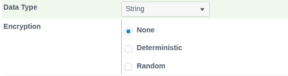

🚀 Get to pre-production in weeks, not months, with private [training](https://www.jube.io/jube-training) direct from
Jube's developer — real sovereignty, zero vendor lock-in.

# Field Level Encryption

Individual String fields extracted by [Request XPath](../../Configuration/Models/RequestXPath/index.html) or
computed by an [Inline Function](../../Configuration/Models/InlineFunctions/index.html) can optionally be encrypted
at the point they are resolved, rather than being stored and archived as plain text. This is intended for elements
that are sensitive (for example, a national identifier or account number extracted from the payload) but that still
need to be persisted - for reporting, for Case display, or so a value can be compared for equality on a later
transaction.

## Enabling encryption on a field

On the Request XPath and Inline Function pages, a String-typed field has an Encryption option with three settings:

| Value         | Effect                                                                                                                                      |
|---------------|---------------------------------------------------------------------------------------------------------------------------------------------|
| None          | The default. The resolved value is stored and archived as plain text, exactly as today.                                                     |
| Deterministic | The value is encrypted with a fixed, value-derived Initialisation Vector (IV), so the same plain text always produces the same cipher text. |
| Random        | The value is encrypted with a fresh random IV every time, so the same plain text produces different cipher text on every invocation.        |

Encryption happens once, before both the live payload write and the archive/report write, so the two copies of the
value can never diverge - there is no separate "encrypt for storage" pass that could fall out of step with what was
actually processed.

## Choosing Deterministic vs Random

This choice matters and is not simply a strength trade-off - it changes what you can subsequently do with the
encrypted value:

* **Deterministic** is required if the field is ever used as, or compared against, a Search Key - for example,
  matching all prior transactions for the same encrypted national identifier. Because the same input always
  produces the same cipher text, equality comparison still works on the encrypted value without ever needing to
  decrypt it. The trade-off, as with any deterministic encryption scheme, is that two records with the same
  plaintext are visibly identical in their cipher text even to someone without the key - it leaks repetition, not
  content.
* **Random** should be preferred whenever the field does not need to support equality matching, since a fresh IV per
  value gives no such repetition signal at all.

## The encryption scheme

Encryption is performed by `AesEncryption` in the `Jube.Cryptography` project - AES with a 256-bit key derived from
the `ElementSymmetricEncryptionKey` Environment Variable via PBKDF2 (`Rfc2898DeriveBytes`, 100,000 iterations,
SHA-256), using that same Environment Variable value as its own salt. Cipher text is stored as the IV concatenated
with the encrypted bytes, Base64-encoded.

Using the encryption key as its own PBKDF2 salt means the salt is not independent of the key - this is a
design trade-off already known to the author (noted in the branch's own commit history) as something to revisit
separately, not an oversight to silently work around in documentation. Flagging here so it stays visible.

**Action Required**: `ElementSymmetricEncryptionKey` ships with the placeholder default
`SuperSecretEncryptionKeyGoesHere` (see [Environment Variables](../EnvironmentVariables/index.html)). Any deployment
that enables field encryption on any Request XPath or Inline Function field must set this to a securely generated,
per-environment value before doing so - the placeholder default must never be relied upon past initial evaluation.
Changing the key after data has already been encrypted under the old key makes that already-encrypted data
undecryptable, so this should be set once, correctly, before the feature is first used in an environment rather than
rotated casually afterwards.

The `AesEncryption` instance for a model is created once, at model synchronisation, and reused for the lifetime of
the process rather than re-derived per transaction - deriving the key via PBKDF2 is deliberately expensive
(100,000 iterations) as a defence against brute-forcing, so re-deriving it on every invocation would have been a
material, and unnecessary, performance cost on the transaction hot path.
