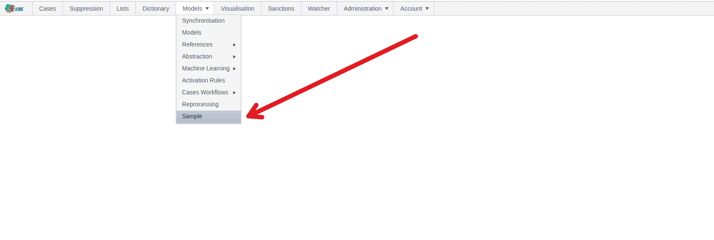
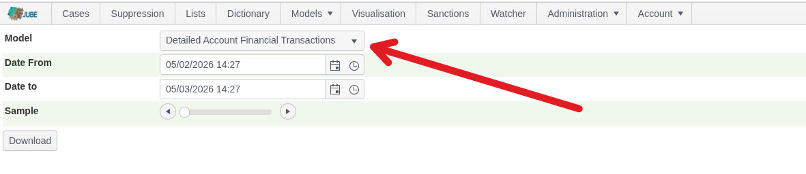
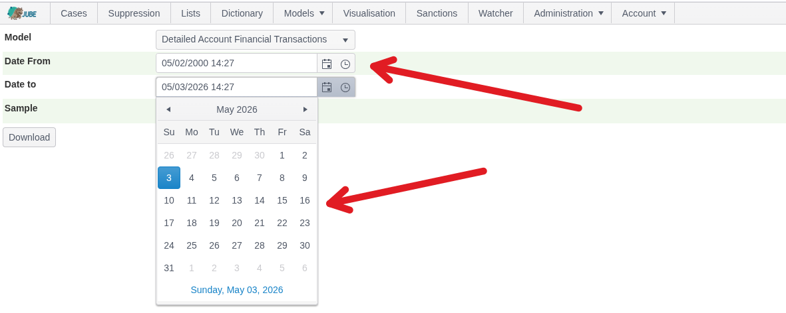
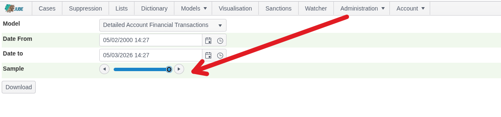
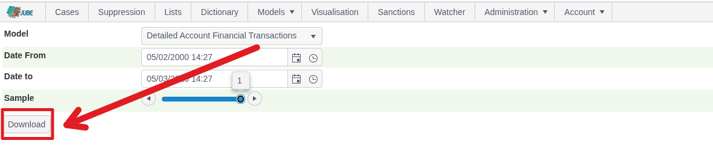
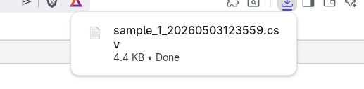
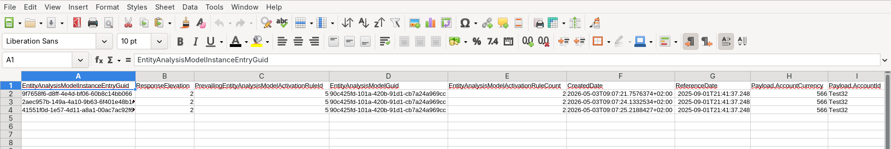

🚀 Get to pre-production in weeks, not months, with private [training](https://www.jube.io/jube-training) direct from Jube's developer — real sovereignty, zero vendor lock-in.

# Sampling

The Sampling page is a lightweight CSV export tool that extracts a representative sample of data for a given date range
and flattens out all model elements to a CSV format for independent ingestion into analytical tools such as R.

Sampling takes the following steps:

* A query is predicated on a defined random selection between a given date range.
* The query returns the JSON from the Archive table.
* All model elements, such as Payload, Abstraction etc, are extracted from the JSON via their JSONPath reprentations,
  before being transposed to a CSV representaton as their datatype (for example, strings are enclosed in double quotes).
* The CSV, including header record, is exported as a file stream, and downloade by the browser.

Navigate Models >>> Sampling:

Select the model to construct the sample for (important as parsing of the Archive JSON varies remarkably by model
configuration):

The date filtering is performed based on the Reference Date and not the Created Date in the Archive. Select the Date
Range
using the Date Time Picker:

The sample is the percentage within the date range selected using a random digit in the underlying query. Use the slider
control to select the sample coverage, which is 100% as follows (all records):

Click the Download button:

On clicking of download the query will be run in the background, and a CSV file downloaded:

This file handles nesting from the model objects with a . seperator in the header and is otherwise a compliance string
escaped CSV which can be ingested into analytical tooling such as R.
