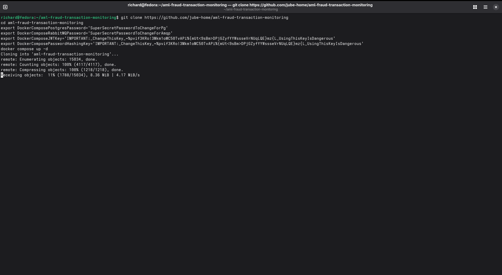
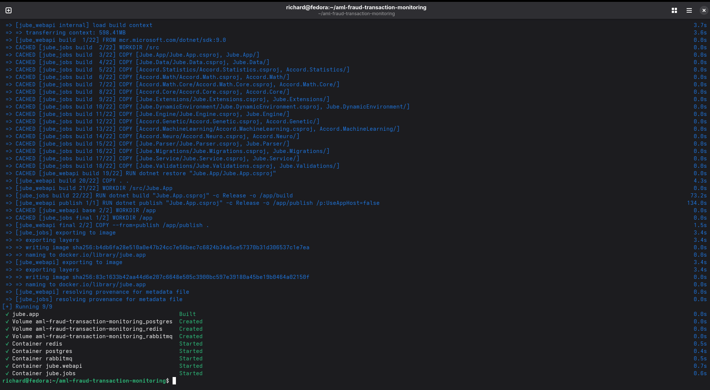

🚀 Get to pre-production in weeks, not months, with private [training](https://www.jube.io/jube-training) direct from
Jube's developer — real sovereignty, zero vendor lock-in.

# Deploying with Docker

Docker is the supported way to get Jube running - a `docker-compose.yml` file at the root of the repository
orchestrates Jube alongside its dependencies (Postgres, Redis). Jube is not published to Docker Hub; the
image is built from source as part of bringing the stack up, so the only prerequisite is Docker itself.

This base install is for evaluation and development only - it is **not** intended for production use. It runs a
single node, connects to Postgres as superuser, and passes secrets as plain shell Environment Variables.
Production deployments should instead follow [Deploying with Jube Cluster](../DeployingWithJubeCluster/index.html),
which covers a load-balanced, highly available, clustered deployment with robust secret management (
`Jube.Cluster/secrets-init.sh`, Docker Swarm secrets, and per-environment generated credentials rather than shared
placeholders).

Jube can be up and running in minutes with the following shell script:

```shell
git clone https://github.com/jube-home/aml-fraud-transaction-monitoring
cd aml-fraud-transaction-monitoring
export DockerComposePostgresPassword='SuperSecretPasswordToChangeForPg'
export DockerComposeJWTKey='IMPORTANT:_ChangeThisKey_~%pvif3KRo!3Mkm1oMC50TvAPi%{mUt<9sBm>DPjGZyfYYWssseVrNUqLQE}mz{L_UsingThisKeyIsDangerous'
export DockerComposeApiHmacKey='IMPORTANT:_ChangeThisKey_~%pvif3KRo!3Mkm1oMC50TvAPi%{mUt<9sBm>DPjGZyfYYWssseVrNUqLQE}mz{L_UsingThisKeyIsDangerous'
export DockerComposePasswordHashingKey='IMPORTANT:_ChangeThisKey_~%pvif3KRo!3Mkm1oMC50TvAPi%{mUt<9sBm>DPjGZyfYYWssseVrNUqLQE}mz{L_UsingThisKeyIsDangerous'
export DockerComposeElementSymmetricEncryptionKey='IMPORTANT:_ChangeThisKey_~%pvif3KRo!3Mkm1oMC50TvAPi%{mUt<9sBm>DPjGZyfYYWssseVrNUqLQE}mz{L_UsingThisKeyIsDangerous'
docker compose up -d
```

Every value above must be changed from the example shown - these are placeholders, not defaults you can leave in
place. `DockerComposePostgresPassword` bootstraps the `postgres` container's own superuser password on first
initialisation (`POSTGRES_PASSWORD`), and is packed by `docker-compose.yml` itself into the otherwise-static
`ConnectionString`/`ReportConnectionString` values for the `jube` service - so it's the one value you set
once and it's used consistently everywhere it's needed, with nothing to keep in sync by hand. `DockerComposeJWTKey`,
`DockerComposeApiHmacKey`, `DockerComposePasswordHashingKey`, and `DockerComposeElementSymmetricEncryptionKey` map
through to Jube's own `JWTKey`, `ApiHmacKey`, `PasswordHashingKey`, and `ElementSymmetricEncryptionKey` Environment
Variables (see [Environment Variables](../../Concepts/EnvironmentVariables/index.html)) respectively, and Jube will
not start with an empty value for `JWTKey` or `PasswordHashingKey` (`ApiHmacKey` is only required before issuing API
keys - see [Environment Variables](../../Concepts/EnvironmentVariables/index.html)).
`ElementSymmetricEncryptionKey` ships with a well-known placeholder default - leaving it unchanged means any value
encrypted via the Inline Script AES helper (see
[Field Level Encryption](../../Concepts/FieldEncryption/index.html)) is trivially reversible by anyone with a copy
of this documentation. None of these five values are hardcoded anywhere in `docker-compose.yml` itself - every
secret the compose file needs comes from the shell Environment at `docker compose up` time.

The export-then-`docker compose up` pattern above passes secrets as plain shell Environment Variables,
which is fine for local evaluation but not how a real deployment should hand over credentials.
`Jube.Cluster/secrets-init.sh`
now provides this for the clustered Docker Swarm deployment - see [Creating
Secrets](../DeployingWithJubeCluster/DeploymentRunbook/index.html#creating-secrets) - generating random credentials and an RSA keypair
and loading them into Swarm's own secret store, resolved at container start via Jube's own `SecretsPath`/`[@Key@]`
Docker Secrets tokenisation already documented in
[Environment Variables](../../Concepts/EnvironmentVariables/index.html). That script relies on `docker secret
create`, which requires Swarm mode and so is not usable from this single-node `docker compose up` quickstart as-is -
this page still needs either a Swarm-mode equivalent or a Compose file-secrets/bind-mount based script before it can
drop the plain shell Environment Variable pattern above.

Copy and paste the full block of shell script above into the terminal. The Jube software will be cloned locally:



The software will be built locally after it has been cloned. Once the Jube Docker image has been built, Docker
Compose will ensure that the remaining dependencies - Postgres and Redis - are available, and then
orchestrate the stack:



Navigate to [http://localhost:5001/](http://localhost:5001/):


The default username/password is Administrator / Administrator, requiring change on first login:


Upon change, navigation to the menu takes place:


## Build dependencies

Nothing further needs installing to build the image - these are called out here only so it's clear why they're in
`Jube.App/Dockerfile` if you're customising it:

* The Kerberos libraries `libkrb5-3`, `libgssapi-krb5-2` and `krb5-user`, required for Negotiate (Windows
  Integrated/Kerberos) authentication - .NET stopped bundling these from .NET 8 onwards, so they are installed
  explicitly as root in the base image stage. `libgssapi-krb5-2` is what the Negotiate P/Invoke calls actually need
  at runtime; `libkrb5-3` is pulled in as its dependency.
* The `Jube.Cryptography` and `Jube.Preservation` projects are copied and built as part of the image, required at
  runtime by Inline Script reflection and by Preservation import/export respectively.

## Hardening beyond the quickstart

The quickstart above connects Jube to Postgres as the `postgres` superuser, which is adequate for evaluation but not
for a real deployment. `docs/GettingStarted/CreateUsers.sql` creates two restricted Postgres users - `service`
(used for the application's `ConnectionString`/`CacheConnectionString`) and `reporting` (used for
`ReportConnectionString`) - scoped to only the grants each actually needs, rather than running as superuser. Neither
restricted user needs DDL rights, since Migration can instead run under a separate, DDL-capable credential via
`MigrationConnectionString` (falling back to `ConnectionString` when unset) - see
[Environment Variables](../../Concepts/EnvironmentVariables/index.html).

`docker-compose.yml` does not yet wire these restricted users in by default - running `CreateUsers.sql` from
Jube.Cluster means also updating the compose file's connection strings and Postgres user setup by hand. Consider whether
this should become part of the default compose stack, or stay a documented manual hardening step for production
deployments specifically. The simple `docker-compose.yml` is not intended for production use, at least without
significant
hardening.

## Sizing the quickstart's Postgres and Redis containers

The root `docker-compose.yml` pins the `postgres` container to fixed memory-related settings (`shared_buffers`,
`work_mem`, `maintenance_work_mem`, `effective_cache_size`, `wal_buffers`, `max_wal_size`, `min_wal_size`,
`max_connections`, `temp_file_limit`) rather than leaving them at Postgres's own conservative defaults, and pins
`redis` to `maxmemory 18gb` with `maxmemory-policy noeviction` alongside `io-threads 4`/`io-threads-do-reads yes`.

These are sized for a development/evaluation host with several GB of RAM to spare, not derived from the container's
actual allocation - resize them (or remove the `command:`/`REDIS_ARGS` overrides entirely and let each engine pick
its own defaults) to match the memory actually available to the host or container before using this compose file as
a starting point for anything beyond local evaluation. `maxmemory-policy noeviction` in particular means Redis will
start refusing writes rather than silently evicting data once `maxmemory` is reached, which is the safer failure mode
for a cache that also holds TTL Counter and cache payload state, but means an undersized `maxmemory` shows up as
write errors rather than degraded performance.

The stack is deployed as a single `jube` service - one image, one container - rather than split across
separate web API and background-jobs services, so every feature flag (reprocessing, cache pruning, sanctions
loading, `EnablePublicInvokeController`, and so on) is enabled together and `LocalCache` stays `True` throughout.

## Beyond a single node

This page covers a single-node Docker Compose deployment, which is the right starting point for evaluation and
proof of concept, but is **not** intended for production use as-is. For a load-balanced, highly available,
clustered deployment with robust secret management, see
[Deploying with Jube Cluster](../DeployingWithJubeCluster/index.html).
